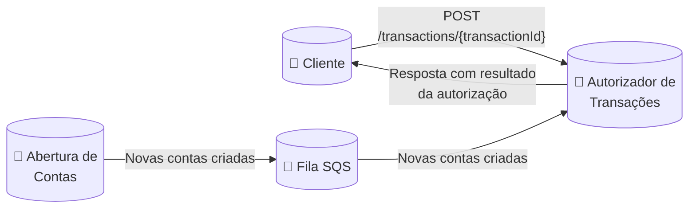
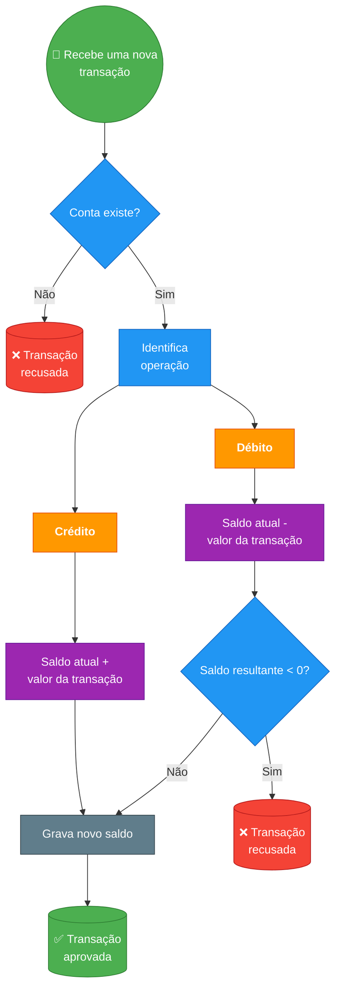

# 🧠 Desafio Técnico Itaú Unibanco – Engenheiro de Software

Olá, candidato!

Você está sendo convidado a participar de um **desafio técnico** para a vaga de **Engenheiro de Software** no **Itaú Unibanco**. Essa é

uma oportunidade de demonstrar suas habilidades técnicas em um contexto real de engenharia de software. A vaga disponível é

para atuar em squads com temas críticos de **core banking**, como:

Cadastro de contas

Autorização de crédito e débito em conta

Extrato bancário

Consulta de saldo

E muito mais

Buscamos um perfil **proativo**, movido por desafios técnicos, com foco em **consistência, disponibilidade e resiliência**.

_🧪_ Desafio

Você deverá construir uma API de autorização de transações financeiras. Essa API vai manipular o saldo de uma conta bancaria

através de operações de crédito, onde o valor da transação é somado ao saldo atual da conta, e débito, onde o valor da transação é

subtraído do saldo atual da conta. Um sistema externo de abertura de conta informa, via mensagem em uma fila no AWS SQS,

quando uma nova conta é aberta.

Escopo do desafio



Requisitos

Será necessário ter instalado o Docker para executar uma fila AWS SQS localmente. Também é recomendado ter instalado o

AWS CLI para interagir com a fila via linha de comando.

Fila AWS SQS com transações sintéticas

Foi disponibilizado um docker-compose com uma fila no **AWS SQS** (usando _localstack_) e um script que produz transações

sintéticas para que seja consumida por sua aplicação.

1. Abra o terminal e acesse o diretório onde está o arquivo **docker-compose.yml** fornecido com o comando **cd <caminho-**
```
para-seu-diretorio> ;
2. Execute o comando docker compose up e aguarde até a mensagem message-generator exited with code 0
```

aparecer no terminal;

3. Sua fila está pronta para ser consumida com 100.000 contas abertas!
Sobre a abertura de contas:

A cada nova conta criada, um sistema externo (fora do escopo do desafio) publica uma mensagem em uma fila no AWS SQS

com as informações da conta, como identificador, titular e timestamp e etc

Novas contas podem ser criadas a qualquer momento (a abertura de contas do banco funciona 24/7)

A cada nova conta aberta, o saldo inicial deve ser **ZERO**

Informações da fila AWS SQS

```
Name: conta-bancaria-criada
Type: standard
URL: http://localhost:4566/000000000000/conta-bancaria-criada
ARN: arn:aws:sqs:sa-east-1:000000000000:conta-bancaria-criada
Region: sa-east-1
```

Teste a disponibilidade das mensagens fazendo o consumo via linha de comando com AWS CLI

```
export AWS_DEFAULT_REGION=sa-east-1
export AWS_ACCESS_KEY_ID=test
export AWS_SECRET_ACCESS_KEY=test
aws --endpoint-url=http://localhost:4566 --region sa-east-1 sqs receive-message --queue-url
http://localhost:4566/000000000000/conta-bancaria-criada --max-number-of-messages 10
```

Payload da Fila SQS

```
{
"account": {
"id": "5b19c8b6-0cc4-4c72-a989-0c2ee15fa975",
"owner": "315e3cfe-f4af-4cd2-b298-a449e614349a",
"created_at": "1634874339",
"status": "ENABLED"
}
}
```

_Sobre a_ autorização de transações_:_

Uma autorização só pode acontecer em uma conta já existente, que foi informada pelo processo de abertura de contas

A autorização pode ser apenas de **CRÉDITO** (soma o valor da transação com o saldo atual da conta) ou **DÉBITO** (subtraí o

valor da transação do saldo atual da conta)

O resultado do processo de autorização de transações deve ser **APROVADO** ou **RECUSADO**

Quando houver uma tentativa de **DÉBITO** que resultar em um saldo menor que zero, o saldo não deve ser alterado e a

transação deve ser **RECUSADA**



O retorno deve conter:

Transação:

Identificador (UUID)

Tipo (CREDIT/DEBIT)

Valor e código de moeda (ISO4217)

Status (SUCCEEDED/FAILED)

Data e horário da transação (ISO8601)

Conta:

Identificador da conta (UUID)

Saldo atual da conta com valor e código de moeda (ISO4217)

Resposta da API

```
{
"transaction": {
"id": "8e8ae808-b154-48b5-9f3e-553935cc4543",
"type": "CREDIT",
"amount": {
"value": 97.07,
"currency": "BRL"
},
"status": "SUCCEEDED",
"timestamp": "2025-07-08T15:57:55-03:00"
},
"account": {
"id": "5b19c8b6-0cc4-4c72-a989-0c2ee15fa975",
"balance": {
"amount": 183.12,
"currency": "BRL"
}
}
}
```

**📋** Instruções

Entregue em até **1 semana** a partir do recebimento do desafio

O código deve ser em **Java** ou **Kotlin**

Disponibilizar todo conteúdo produzido em um **repositório público no GitHub**

Todo código da aplicação e/ou infraestrutura

Documentação, diagramas, instruções para execução local, etc

**Não** inclua esse arquivo no seu repositório

Notifique a conclusão do desafio enviando um email com o assunto "Desafio técnico Itaú - **<nome-do-candidato>** " e contendo o

link do repositório para:

edinei.silva@itau-unibanco.com.br

caio.sanchez@itau-unibanco.com.br

viviani.cruz@itau-unibanco.com.br

frank.volpe@itau-unibanco.com.br

**💡** Dicas para Construção da Aplicação

Projete sua aplicação para um cenário de alta volumetria, pensando sempre em escalabilidade, disponibilidade, resiliência e

consistência

Registre suas principais decisões com os motivadores e tradeoffs, como a escolha do banco de dados, modelos de integração,

algoritmos, etc

Pense na sua aplicação como algo que seria entregue em produção, com logging, métricas, conteinerização e tudo que for

necessário para que esteja **production ready**

Aplique, onde for oportuno, padrões de resiliência como retries, backoff, full jitter, circuit breaker, etc

Aplicações de missão crítica devem ter atenção redobrada na qualidade, portanto, não se esqueça dos testes, inclusive dos

corner cases_!_

Facilite a revisão do seu código com uma boa documentação, instruções para execução local, incluindo docker-compose com as

dependência necessárias e coleção de requisições

Mostre, através de um diagrama, o que seria necessário para deploy dessa aplicação em cloud pública, como API Gateway, load

balancers, orquestrador de containers, compute type, etc

Crie uma proposta de pipeline com uma estratégia de deploy que consiga mitigar o risco de um bug na aplicação impactar todos

os clientes

Não teve tempo suficiente para implementar algum pattern ou algoritmo? Sem problema, apenas documente o que poderia ser

implementado com os motivadores

Referências

Inspire-se

Utilize as referências abaixo como inspiração para construir sua aplicação!

Designing Data-Intensive Applications (Martin Kleppmann) — Livro referência sobre sistemas escaláveis, consistência, tolerância

a falhas e bancos de dados.

Production Ready Microservices (Susan Fowler) — Livro sobre práticas para sistemas prontos para produção.

The Twelve-Factor App — Princípios para aplicações modernas, escaláveis e resilientes.

Site Reliability Engineer: How Google Runs Production Systems - Princípios de engenharia de software para garantir a

confiabilidade, escalabilidade e automação na operação de sistemas em larga escala.

AWS Well-Architected Framework — Práticas recomendadas de arquitetura em cloud.

Hexagonal architecture pattern (AWS) - Padrão de arquitetura hexagonal.

Best Practices in API Design (OpenAPI/Swagger) - Boas práticas no design de API RESTful.

What is the CAP theorem? (IBM) - O teorema CAP diz que, em sistemas distribuídos, só é possível garantir dois dos três:

consistência, disponibilidade ou tolerância a partições.

What's the Difference Between an ACID and a BASE Database? (AWS) - Características ACID e BASE em banco de dados

Resilience Patterns (Microsoft) — Catálogo de padrões de resiliência.

Blue/Green Deployments (AWS) - Estratégia de publicação de software onde dois ambientes idênticos (blue e green) são

usados para alternar o tráfego entre versões, permitindo atualizações sem downtime e rollback rápido em caso de falha.

Canary Releases - Estratégia de publicação de software em que a nova versão é liberada gradualmente para uma pequena

parte dos usuários, permitindo monitorar e validar o sistema antes de disponibilizar para todos, reduzindo riscos de falhas em

produção.

Testing Strategies in Microservices Architecture (ThoughtWorks) — Estratégias de testes em sistemas distribuídos.

Test Pyramid (ThoughtWorks) — Pirâmide de testes para cobertura eficiente.

Documentando APIs com OpenAPI/Swagger - Especificação para descrever, documentar e padronizar APIs REST de forma

legível por humanos e máquinas, facilitando a integração, testes e automação de APIs.

Architectural Decision Records (ADR) — Guia sobre como registrar decisões arquiteturais.

Make a README - Como escrever um bom README.