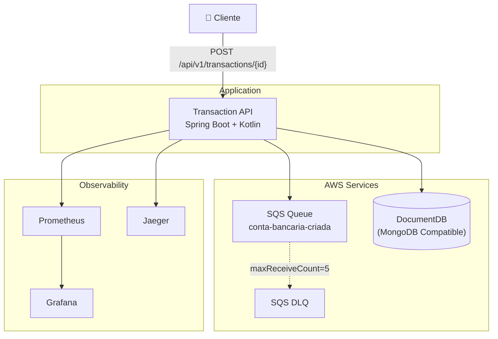

# 🏦 Transaction API - Autorização de Transações Financeiras

[](https://github.com/ocborghi/desafiodecdigoita/actions/workflows/ci.yml)
[]()

API REST para autorização de transações financeiras, construída com **Kotlin + Spring Boot 3.3**, seguindo arquitetura **Domain Driven Design (DDD)** com padrões de resiliência (Circuit Breaker, DLQ, Retry).

## 📋 Table of Contents

- [Visão Geral](#visão-geral)
- [Arquitetura](#arquitetura)
- [Pré-requisitos](#pré-requisitos)
- [Execução Local](#execução-local)
- [Endpoints da API](#endpoints-da-api)
- [Estrutura do Projeto](#estrutura-do-projeto)
- [Padrões de Resiliência](#padrões-de-resiliência)
- [Testes](#testes)
- [Deploy na AWS](#deploy-na-aws)
- [CI/CD](#cicd)
- [Observabilidade](#observabilidade)
- [Decisões Arquiteturais](#decisões-arquiteturais)
- [Scripts de Apoio](#scripts-de-apoio)

## Visão Geral

Sistema de autorização de transações financeiras que:

1. **Registra contas** recebendo mensagens de uma fila SQS (abertura de contas)
2. **Autoriza transações** (crédito/débito) via REST API
3. **Garante resiliência** com Circuit Breaker, Dead Letter Queue e Retry

## Arquitetura



## Pré-requisitos

| Ferramenta | Versão | Comando de verificação |
|-----------|--------|----------------------|
| Java | 21+ | `java -version` |
| Maven | 3.9+ | `mvn -version` |
| Docker | 24+ | `docker --version` |
| Docker Compose | v2+ | `docker compose version` |
| AWS CLI | 2+ | `aws --version` |

## Execução Local

### Opção 1: Docker (Recomendado)

```bash
# 1. Clonar o repositório
git clone https://github.com/ocborghi/desafiodecdigoita.git
cd desafiodecdigoita

# 2. Rodar ambiente local
./scripts/run-local.sh
```

### Opção 2: Maven (Desenvolvimento)

```bash
# 1. Iniciar apenas infraestrutura
docker compose up -d mongodb localstack

# 2. Compilar e rodar
mvn clean package -DskipTests
java -jar transaction-api/target/*.jar
```

### Gerar Token de Autenticação

```bash
curl -X POST http://localhost:8080/api/v1/auth/token \
  -H "Content-Type: application/json" \
  -d '{"client_id":"transaction-api-client","client_secret":"super-secret-key-123"}'
```

### Testar Transação

```bash
# Usar o token obtido acima
curl -X POST http://localhost:8080/api/v1/transactions/$(uuidgen) \
  -H "Content-Type: application/json" \
  -H "Authorization: Bearer <TOKEN>" \
  -d '{"account_id":"<ACCOUNT_ID>","type":"CREDIT","amount":{"value":100.00,"currency":"BRL"}}'
```

## Endpoints da API

> ⚠️ Todos os endpoints (exceto `/api/v1/auth/token`) requerem header `Authorization: Bearer {JWT_TOKEN}`

| Método | Endpoint | Descrição |
|--------|----------|-----------|
| `POST` | `/api/v1/auth/token` | Gerar token JWT |
| `POST` | `/api/v1/transactions/{transactionId}` | Autorizar transação |
| `GET` | `/actuator/health` | Health check |
| `GET` | `/actuator/prometheus` | Métricas Prometheus |

### POST `/api/v1/transactions/{transactionId}`

**Request Body:**
```json
{
  "account_id": "5b19c8b6-0cc4-4c72-a989-0c2ee15fa975",
  "type": "CREDIT",
  "amount": {
    "value": 97.07,
    "currency": "BRL"
  }
}
```

**Response (200 OK):**
```json
{
  "transaction": {
    "id": "8e8ae808-b154-48b5-9f3e-553935cc4543",
    "type": "CREDIT",
    "amount": { "value": 97.07, "currency": "BRL" },
    "status": "SUCCEEDED",
    "timestamp": "2025-07-08T15:57:55-03:00"
  },
  "account": {
    "id": "5b19c8b6-0cc4-4c72-a989-0c2ee15fa975",
    "balance": { "amount": 183.12, "currency": "BRL" }
  }
}
```

## Estrutura do Projeto

```
desafiodecdigoita/
├── pom.xml                          # Parent POM (multi-module)
├── docker-compose.yml               # Local environment
├── Dockerfile                       # Multi-stage Docker build
├── transaction-domain/              # Domain Layer (Core)
├── transaction-application/         # Application Layer (Use Cases)
├── transaction-infrastructure/      # Infrastructure Layer (Adapters)
├── transaction-api/                 # API Layer (Controllers)
├── terraform/                       # Infrastructure as Code
├── .github/workflows/               # CI/CD
├── postman/                         # Collections
├── scripts/                         # Scripts de Apoio
└── docs/                            # Documentação
```

### DDD Layers

| Módulo | Responsabilidade |
|--------|-----------------|
| `transaction-domain` | Modelos, Exceções, Ports (interfaces), Domain Services |
| `transaction-application` | DTOs, Mappers, Use Cases, Consumers |
| `transaction-infrastructure` | Repositórios, Configurações, Security, Messaging |
| `transaction-api` | Controllers, Exception Handlers, Configuração Spring Boot |

## Padrões de Resiliência

### Circuit Breaker (Resilience4j)

```
CLOSED → OPEN (failureRate ≥ 50%) → HALF-OPEN (30s) → CLOSED
```

### Dead Letter Queue (DLQ)

- Mensagens que falham 5x vão para DLQ
- Reprocessador automático a cada 5 minutos
- Idempotência garantida

### Retry com Backoff

- Max 3 tentativas com backoff exponencial
- Aplicado em operações MongoDB e SQS

## Testes

```bash
# Todos os testes
./scripts/test.sh

# Apenas unitários
./scripts/test-unit.sh

# Apenas integração
./scripts/test-integration.sh

# Cobertura (≥80%)
./scripts/coverage.sh
```

### Pirâmide de Testes

| Camada | Quantidade | Cobertura |
|--------|------------|-----------|
| Unitários | 70 | ≥80% em todos os módulos |
| Integração | 2 | TestContainers (MongoDB) |
| E2E | Postman | Manual |

## Deploy na AWS

### Terraform

```bash
cd terraform
terraform init
terraform plan -var-file="environments/dev.tfvars"
terraform apply -var-file="environments/dev.tfvars"
```

### Serviços AWS

| Serviço | Uso |
|---------|-----|
| ECS Fargate | Orquestração de containers |
| ECR | Repositório de imagens Docker |
| DocumentDB | Banco MongoDB compatível |
| SQS | Filas de mensagens |
| ALB | Load balancer |
| CloudWatch | Logs e alarmes |
| IAM | Permissões |
| Secrets Manager | Gerenciamento de senhas |

## CI/CD

| Workflow | Trigger | Ação |
|----------|---------|------|
| `ci.yml` | Push/PR | Build + Test + Coverage + Docker |
| `cd-staging.yml` | Push to develop | Deploy staging |
| `cd-production.yml` | Manual | Deploy production |

## Observabilidade

| Serviço | URL | Credenciais |
|---------|-----|-------------|
| Grafana | http://localhost:3000 | admin / admin123 |
| Prometheus | http://localhost:9090 | - |
| Jaeger | http://localhost:16686 | - |

### Métricas Customizadas

| Métrica | Tipo | Descrição |
|---------|------|-----------|
| `transaction_total` | Counter | Total de transações |
| `transaction.authorization.latency` | Timer | Latência de autorização |
| `circuitbreaker_state` | Gauge | Estado do Circuit Breaker |
| `sqs_messages_consumed_total` | Counter | Mensagens SQS consumidas |
| `dlq_messages_reprocessed_total` | Counter | Mensagens reprocessadas |

## Decisões Arquiteturais (ADR)

| ADR | Decisão | Motivação |
|-----|---------|-----------|
| 001 | Kotlin + Spring Boot | Conciseness, null safety, coroutine support |
| 002 | MongoDB (DocumentDB) | Flexible model, AWS compatible |
| 003 | DDD + Multi-Module | Separation of concerns, testability |
| 004 | Resilience4j | Industry standard, lightweight |
| 005 | TestContainers | Reliable integration tests |
| 006 | JaCoCo | Integrated coverage enforcement |
| 007 | ECS Fargate | Serverless containers |
| 008 | Consul | Centralized config, hotswap |

## Scripts de Apoio

| Script | Descrição |
|--------|-----------|
| `run-local.sh` | Roda app via docker-compose |
| `build.sh` | Build completo (mvn clean package) |
| `test.sh` | Roda todos os testes |
| `test-unit.sh` | Apenas testes unitários |
| `test-integration.sh` | Apenas testes de integração |
| `coverage.sh` | Gera relatório de cobertura |
| `seed-accounts.sh` | Popula SQS com contas de teste |
| `check-queue.sh` | Verifica mensagens na fila |
| `seed-secrets.sh` | Popula Vault com secrets |
| `seed-consul.sh` | Popula Consul com configs |

## License

MIT