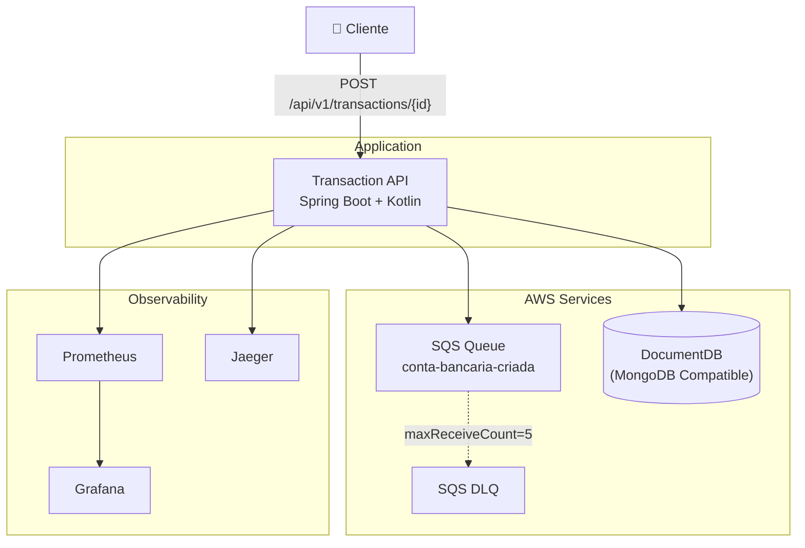

# 🏦 Transaction API - Autorização de Transações Financeiras

[](https://github.com/ocborghi/desafiodecdigoita/actions/workflows/ci.yml)
[]()

API REST para autorização de transações financeiras, construída com **Kotlin + Spring Boot 3.3**, seguindo arquitetura **Domain Driven Design (DDD)** com padrões de resiliência (Circuit Breaker, DLQ, Retry).

## 📋 Table of Contents

- [Sistemas Suportados](#sistemas-suportados)
- [Pré-requisitos](#pré-requisitos)
- [Visão Geral](#visão-geral)
- [Arquitetura](#arquitetura)
- [Scripts de Execução](#scripts-de-execução)
- [Scripts de Apoio](#scripts-de-apoio)
- [Endpoints da API](#endpoints-da-api)
- [Estrutura do Projeto](#estrutura-do-projeto)
- [Padrões de Resiliência](#padrões-de-resiliência)
- [Testes](#testes)
- [Deploy na AWS](#deploy-na-aws)
- [CI/CD](#cicd)
- [Observabilidade](#observabilidade)
- [Decisões Arquiteturais](#decisões-arquiteturais)

---

## Sistemas Suportados

| Sistema | Suporte | Observação |
|---------|---------|------------|
| **Linux** (Ubuntu, Debian, Fedora, etc.) | ✅ Suportado | Nativo |
| **macOS** | ✅ Suportado | Via Docker Desktop |
| **Windows** | ✅ Suportado | **Apenas via WSL2** (Windows Subsystem for Linux) |

> ⚠️ **Windows:** Os scripts shell (.sh) **não funcionam** no CMD ou PowerShell. Execute-os dentro do **WSL2**. Para instalar:
> ```powershell
> wsl --install
> ```
> Após reiniciar, abra o terminal WSL (Ubuntu) e clone o repositório.

---

## Pré-requisitos

### Ferramentas Obrigatórias

| Ferramenta | Versão Mínima | Comando de Verificação | Instalação (Ubuntu/Debian) |
|-----------|---------------|----------------------|---------------------------|
| **Docker** | 24+ | `docker --version` | [docs.docker.com/engine/install](https://docs.docker.com/engine/install/) |
| **Docker Compose** | v2+ | `docker compose version` | Incluído com Docker Desktop |
| **Java JDK** | 21+ | `java -version` | `sudo apt install openjdk-21-jdk` |
| **Maven** | 3.9+ | `mvn -version` | `sudo apt install maven` |
| **AWS CLI** | 2+ | `aws --version` | [docs.aws.amazon.com/cli/latest/userguide/getting-started-install.html](https://docs.aws.amazon.com/cli/latest/userguide/getting-started-install.html) |
| **curl** | Qualquer | `curl --version` | `sudo apt install curl` |
| **jq** | Qualquer | `jq --version` | `sudo apt install jq` |
| **GNU coreutils** | Qualquer | `uuidgen --version` | `sudo apt install uuid-runtime` (para `uuidgen`) |

### Pacotes Linux (Ubuntu/Debian)

```bash
# Instalar todas as dependências de uma vez
sudo apt update && sudo apt install -y \
  docker.io docker-compose-v2 \
  openjdk-21-jdk \
  maven \
  curl jq \
  uuid-runtime
```

### Verificação Rápida

```bash
docker --version        # Docker 24+
docker compose version  # Docker Compose v2+
java -version           # OpenJDK 21+
mvn -version            # Maven 3.9+
aws --version           # AWS CLI 2+
```

---

## Visão Geral

Sistema de autorização de transações financeiras que:

1. **Registra contas** recebendo mensagens de uma fila SQS (abertura de contas)
2. **Autoriza transações** (crédito/débito) via REST API
3. **Garante resiliência** com Circuit Breaker, Dead Letter Queue e Retry

---

## Arquitetura



---

## Scripts de Execução

### `stop-all.sh` — Parar Todos os Serviços

Para todos os serviços do projeto: containers Docker e aplicação Java (se estiver rodando localmente).

```bash
./scripts/stop-all.sh
```

| Ação | Descrição |
|------|-----------|
| Mata processos Java | Para a aplicação Transaction API (profile local) |
| Para containers | `docker compose down -v` (remove containers e volumes) |
| Idempotente | Pode ser chamado várias vezes sem efeitos colaterais |

---

### `run-docker.sh` — Ambiente Docker Completo (Recomendado)

Roda **tudo** em containers Docker: API, MongoDB, LocalStack (SQS), Vault, Consul, Prometheus, Jaeger, Loki, Grafana.

```bash
./scripts/run-docker.sh
```

| Etapa | Descrição |
|-------|-----------|
| 1. Pré-requisitos | Verifica se Docker está rodando |
| 2. stop-all | Para serviços anteriores automaticamente |
| 3. Infraestrutura | Sobe Vault, MongoDB, LocalStack, Consul |
| 4. Vault | Aguarda Vault ficar saudável |
| 5. SQS | Cria filas `conta-bancaria-criada` e DLQ |
| 6. Vault Secrets | Popula secrets (MongoDB, JWT, AWS, Credentials) |
| 7. Consul Config | Popula configs centralizadas |
| 8. App + Observability | Sobe API + Prometheus + Jaeger + Loki + Grafana |
| 9. Dashboards | Carrega dashboards do Grafana automaticamente |

**Pré-requisitos:** Docker

---

### `run-local.sh` — API via Java + Infra via Docker

Roda a API via Java localmente (com hot-reload), infraestrutura + observabilidade via Docker.

```bash
./scripts/run-local.sh

# Para parar: Ctrl+C (cleanup automático via trap)
```

| Etapa | Descrição |
|-------|-----------|
| 1. Pré-requisitos | Verifica Docker, Java 21+, Maven 3.9+ |
| 2. stop-all | Para serviços anteriores automaticamente |
| 3. Infraestrutura | Sobe todos os containers Docker |
| 4. Vault | Aguarda Vault ficar saudável |
| 5. SQS | Cria filas no LocalStack |
| 6. Vault Secrets | Popula secrets |
| 7. Consul Config | Popula configs centralizadas |
| 8. Maven Build | Compila a aplicação (`mvn clean package`) |
| 9. Java Start | Inicia a aplicação via `java -cp` (profile local) |
| 10. Dashboards | Carrega dashboards do Grafana automaticamente |

**Pré-requisitos:** Docker + Java 21+ + Maven 3.9+

**Cleanup automático:** O script captura `SIGINT`/`SIGTERM`/`EXIT` via `trap` e para tanto a aplicação Java quanto os containers Docker.

---

### `run-aws.sh` — Deploy na AWS via Terraform

Faz deploy da infraestrutura e aplicação na AWS utilizando Terraform.

```bash
# Deploy interativo (com confirmação)
./scripts/run-aws.sh

# Deploy não-interativo (para CI/CD)
ENVIRONMENT=staging AUTO_APPROVE=true ./scripts/run-aws.sh
```

| Variável de Ambiente | Valor Padrão | Descrição |
|---------------------|-------------|-----------|
| `ENVIRONMENT` | `dev` | Ambiente: `dev` ou `staging` |
| `AUTO_APPROVE` | `false` | Se `true`, pula confirmação (CI/CD) |
| `AWS_REGION` | `sa-east-1` | Região AWS |

**Pré-requisitos:** AWS CLI configurado + credenciais AWS + Terraform

**Serviços AWS criados:**
- ECS Fargate (orquestração)
- ECR (repositório de imagens)
- DocumentDB (MongoDB compatível)
- SQS + DLQ
- ALB (load balancer)
- VPC + Subnets + NAT Gateway
- IAM Roles + CloudWatch Logs

---

## Scripts de Apoio

| Script | Descrição | Uso |
|--------|-----------|-----|
| `stop-all.sh` | Para todos os serviços (Java + Docker) | `./scripts/stop-all.sh` |
| `run-docker.sh` | Roda ambiente Docker completo | `./scripts/run-docker.sh` |
| `run-local.sh` | Roda API via Java + infra via Docker | `./scripts/run-local.sh` |
| `run-aws.sh` | Deploy na AWS via Terraform | `./scripts/run-aws.sh` |
| `build.sh` | Build completo (`mvn clean package`) | `./scripts/build.sh` |
| `test.sh` | Roda todos os testes (unit + integration) | `./scripts/test.sh` |
| `test-unit.sh` | Apenas testes unitários | `./scripts/test-unit.sh` |
| `test-integration.sh` | Apenas testes de integração (TestContainers) | `./scripts/test-integration.sh` |
| `coverage.sh` | Gera relatório de cobertura (≥80%) | `./scripts/coverage.sh` |
| `seed-accounts.sh` | Popula SQS com 10 contas de teste | `./scripts/seed-accounts.sh` |
| `check-queue.sh` | Verifica mensagens na fila SQS | `./scripts/check-queue.sh` |
| `seed-secrets.sh` | Popula Vault com secrets | `./scripts/seed-secrets.sh` |
| `seed-consul.sh` | Popula Consul com configs | `./scripts/seed-consul.sh` |

---

## Endpoints da API

> ⚠️ Todos os endpoints (exceto `/api/v1/auth/token`) requerem header `Authorization: Bearer {JWT_TOKEN}`

| Método | Endpoint | Descrição |
|--------|----------|-----------|
| `POST` | `/api/v1/auth/token` | Gerar token JWT |
| `POST` | `/api/v1/transactions/{transactionId}` | Autorizar transação |
| `GET` | `/actuator/health` | Health check |
| `GET` | `/actuator/prometheus` | Métricas Prometheus |

### Gerar Token de Autenticação

```bash
curl -X POST http://localhost:8080/api/v1/auth/token \
  -H "Content-Type: application/json" \
  -d '{"client_id":"transaction-api-client","client_secret":"super-secret-key-123"}'
```

### Popular Contas de Teste (via SQS)

```bash
export AWS_ACCESS_KEY_ID=test
export AWS_SECRET_ACCESS_KEY=test
export AWS_DEFAULT_REGION=sa-east-1
./scripts/seed-accounts.sh
```

### Testar Transação

```bash
# Usar o token obtido acima e um ACCOUNT_ID do seed
curl -X POST http://localhost:8080/api/v1/transactions/$(cat /proc/sys/kernel/random/uuid) \
  -H "Content-Type: application/json" \
  -H "Authorization: Bearer <TOKEN>" \
  -d '{"account_id":"<ACCOUNT_ID>","type":"CREDIT","amount":{"value":100.00,"currency":"BRL"}}'
```

### POST `/api/v1/transactions/{transactionId}`

**Request Body:**
```json
{
  "account_id": "5b19c8b6-0cc4-4c72-a989-0c2ee15fa975",
  "type": "CREDIT",
  "amount": {
    "value": 97.07,
    "currency": "BRL"
  }
}
```

**Response (200 OK):**
```json
{
  "transaction": {
    "id": "8e8ae808-b154-48b5-9f3e-553935cc4543",
    "type": "CREDIT",
    "amount": { "value": 97.07, "currency": "BRL" },
    "status": "SUCCEEDED",
    "timestamp": "2025-07-08T15:57:55-03:00"
  },
  "account": {
    "id": "5b19c8b6-0cc4-4c72-a989-0c2ee15fa975",
    "balance": { "amount": 183.12, "currency": "BRL" }
  }
}
```

### Credenciais Padrão

| Serviço | Credenciais |
|---------|-------------|
| **API Client** | `client_id: transaction-api-client` / `client_secret: super-secret-key-123` |
| **API Readonly** | `client_id: transaction-api-readonly` / `client_secret: super-secret-key-123` |
| **Grafana** | `admin` / `admin123` |
| **Vault** | Token: `root-token` |
| **MongoDB** | `admin` / `admin123` |
| **AWS (LocalStack)** | `test` / `test` |

### URLs de Acesso

| Serviço | URL | Descrição |
|---------|-----|-----------|
| **API** | http://localhost:8080 | Transaction API |
| **Swagger UI** | http://localhost:8080/swagger-ui.html | Documentação interativa |
| **Health Check** | http://localhost:8080/actuator/health | Status da aplicação |
| **Prometheus Metrics** | http://localhost:8080/actuator/prometheus | Métricas em formato Prometheus |
| **Grafana** | http://localhost:3000 | Dashboards (admin/admin123) |
| **Prometheus** | http://localhost:9090 | Consulta de métricas |
| **Jaeger** | http://localhost:16686 | Distributed tracing |
| **Loki** | http://localhost:3100 | Logs |
| **Vault** | http://localhost:8200 | Secrets (token: root-token) |
| **Consul** | http://localhost:8500 | Config management |
| **MongoDB** | localhost:27017 | Banco de dados |
| **LocalStack** | http://localhost:4566 | AWS services (SQS) |

---

## Estrutura do Projeto

```
desafiodecdigoita/
├── pom.xml                          # Parent POM (multi-module)
├── docker-compose.yml               # Local environment
├── Dockerfile                       # Multi-stage Docker build
├── transaction-domain/              # Domain Layer (Core)
├── transaction-application/         # Application Layer (Use Cases)
├── transaction-infrastructure/      # Infrastructure Layer (Adapters)
├── transaction-api/                 # API Layer (Controllers)
├── terraform/                       # Infrastructure as Code
├── .github/workflows/               # CI/CD
├── postman/                         # Collections
├── scripts/                         # Scripts de Apoio
├── observability/                   # Configurações de observabilidade
└── docs/                            # Documentação
```

### DDD Layers

| Módulo | Responsabilidade |
|--------|-----------------|
| `transaction-domain` | Modelos, Exceções, Ports (interfaces), Domain Services |
| `transaction-application` | DTOs, Mappers, Use Cases, Consumers |
| `transaction-infrastructure` | Repositórios, Configurações, Security, Messaging |
| `transaction-api` | Controllers, Exception Handlers, Configuração Spring Boot |

---

## Padrões de Resiliência

### Circuit Breaker (Resilience4j)

```
CLOSED → OPEN (failureRate ≥ 50%) → HALF-OPEN (30s) → CLOSED
```

### Dead Letter Queue (DLQ)

- Mensagens que falham 5x vão para DLQ
- Reprocessador automático a cada 5 minutos
- Idempotência garantida

### Retry com Backoff

- Max 3 tentativas com backoff exponencial
- Aplicado em operações MongoDB e SQS

---

## Testes

```bash
# Todos os testes
./scripts/test.sh

# Apenas unitários
./scripts/test-unit.sh

# Apenas integração
./scripts/test-integration.sh

# Cobertura (≥80%)
./scripts/coverage.sh
```

### Pirâmide de Testes

| Camada | Quantidade | Cobertura |
|--------|------------|-----------|
| Unitários | 70 | ≥80% em todos os módulos |
| Integração | 2 | TestContainers (MongoDB) |
| E2E | Postman | Manual |

### Testando com Postman

A collection `postman/TransactionAPI.postman_collection.json` contém todos os endpoints da API. Existem 3 ambientes pré-configurados:

| Ambiente | Arquivo | BASE_URL | Uso |
|----------|---------|----------|-----|
| **Local** | `Local.postman_environment.json` | `http://localhost:8080` | Desenvolvimento local (Java direto) |
| **Docker** | `Docker.postman_environment.json` | `http://localhost:8080` | docker-compose up (porta 8080) |
| **AWS** | `AWS.postman_environment.json` | URL do ALB | Deploy na AWS |

#### Passo a passo

1. **Importar a collection:**
   - Postman → **Import** → selecionar `postman/TransactionAPI.postman_collection.json`

2. **Importar o ambiente:**
   - Postman → **Environments** → **Import** → selecionar o arquivo do ambiente desejado (ex: `Local.postman_environment.json`)

3. **Selecionar o ambiente:**
   - No canto superior direito do Postman, selecionar o ambiente importado

4. **Obter token de autenticação:**
   - Abrir a request `🔑 Auth → POST /api/v1/auth/token`
   - Clicar **Send**
   - A variável `TOKEN` será preenchida automaticamente via *Tests script*

5. **Popular contas de teste:**
   - Executar `./scripts/seed-accounts.sh` no terminal
   - A variável `ACCOUNT_ID` já vem pré-configurada no ambiente

6. **Testar transações:**
   - Abrir `💰 Transactions → POST /api/v1/transactions/{transactionId}`
   - Gerar um novo UUID para `transactionId` (o valor pré-configurado usa `{{$guid}}`)
   - Clicar **Send**

#### Variáveis por Ambiente

| Variável | Local | Docker | AWS |
|----------|-------|--------|-----|
| `BASE_URL` | `http://localhost:8080` | `http://localhost:8080` | URL do ALB |
| `TOKEN` | *(auto via Tests)* | *(auto via Tests)* | *(auto via Tests)* |
| `ACCOUNT_ID` | `5b19c8b6-...` | `5b19c8b6-...` | `5b19c8b6-...` |
| `CLIENT_ID` | `transaction-api-client` | `transaction-api-client` | `transaction-api-client` |
| `CLIENT_SECRET` | `super-secret-key-123` | `super-secret-key-123` | *(via Secrets Manager)* |

> 💡 **Dica:** O token JWT é obtido automaticamente a cada chamada de auth graças ao script de teste no Postman. A variável `TOKEN` é atualizada para todas as requests da collection.

---

## Deploy na AWS

### Terraform

```bash
cd terraform
terraform init
terraform plan -var-file="environments/dev.tfvars"
terraform apply -var-file="environments/dev.tfvars"
```

### Via Script

```bash
# Deploy interativo
./scripts/run-aws.sh

# Deploy não-interativo (CI/CD)
ENVIRONMENT=staging AUTO_APPROVE=true ./scripts/run-aws.sh
```

### Serviços AWS

| Serviço | Uso |
|---------|-----|
| ECS Fargate | Orquestração de containers |
| ECR | Repositório de imagens Docker |
| DocumentDB | Banco MongoDB compatível |
| SQS | Filas de mensagens |
| ALB | Load balancer |
| CloudWatch | Logs e alarmes |
| IAM | Permissões |
| Secrets Manager | Gerenciamento de senhas |

---

## CI/CD

| Workflow | Trigger | Ação |
|----------|---------|------|
| `ci.yml` | Push/PR | Build + Test + Coverage + Docker |
| `cd-staging.yml` | Push to develop | Deploy staging |
| `cd-production.yml` | Manual | Deploy production |

---

## Observabilidade

### URLs de Acesso

| Serviço | URL | Credenciais | Descrição |
|---------|-----|-------------|-----------|
| **Grafana** | http://localhost:3000 | admin / admin123 | Dashboards e métricas |
| **Prometheus** | http://localhost:9090 | - | Consulta direta de métricas |
| **Jaeger** | http://localhost:16686 | - | Distributed tracing |
| **Loki** | http://localhost:3100 | - | Logs estruturados |

### Dashboards Grafana

Ao acessar http://localhost:3000, navegue em **Dashboards** → **Transaction API** para ver os 4 dashboards disponíveis:

| Dashboard | Descrição |
|-----------|-----------|
| **Transaction API - Overview** | Taxa de sucesso, latência P50/P90/P95, TPS, Circuit Breaker, SQS |
| **Transaction API - DLQ Monitoring** | Mensagens recebidas, taxa de reprocessamento, latência |
| **Transaction API - Infrastructure** | JVM Memory, GC Pause, CPU, HTTP Request Rate |
| **Transaction API** | Visão geral consolidada |

### Métricas Customizadas

| Métrica | Tipo | Descrição |
|---------|------|-----------|
| `transaction_total` | Counter | Total de transações (tags: type, status) |
| `transaction.authorization.latency` | Timer | Latência de autorização (P50, P90, P95) |
| `circuitbreaker_state` | Gauge | Estado do Circuit Breaker |
| `sqs_messages_consumed_total` | Counter | Mensagens SQS consumidas |
| `dlq_messages_reprocessed_total` | Counter | Mensagens reprocessadas da DLQ |

### Queries Prometheus (Exemplos)

```promql
# Taxa de sucesso das transações
rate(transaction_total{status="SUCCEEDED"}[5m]) / rate(transaction_total[5m]) * 100

# Latência P95
histogram_quantile(0.95, rate(transaction_authorization_latency_seconds_bucket[5m]))

# Estado do Circuit Breaker (0=CLOSED, 1=OPEN, 2=HALF_OPEN)
resilience4j_circuitbreaker_state

# Uso de memória heap
jvm_memory_used_bytes{area="heap"}
```

### Logs com Loki (Grafana → Explore → Loki)

```logql
# Todos os logs da aplicação
{container="transaction-api"}

# Apenas logs de erro
{container="transaction-api"} |= "ERROR"

# Logs de transação
{container="transaction-api"} |= "transaction" |= "authorize"
```

---

## Decisões Arquiteturais (ADR)

| ADR | Decisão | Motivação |
|-----|---------|-----------|
| 001 | Kotlin + Spring Boot | Conciseness, null safety, coroutine support |
| 002 | MongoDB (DocumentDB) | Flexible model, AWS compatible |
| 003 | DDD + Multi-Module | Separation of concerns, testability |
| 004 | Resilience4j | Industry standard, lightweight |
| 005 | TestContainers | Reliable integration tests |
| 006 | JaCoCo | Integrated coverage enforcement |
| 007 | ECS Fargate | Serverless containers |
| 008 | Consul | Centralized config, hotswap |

## License

MIT